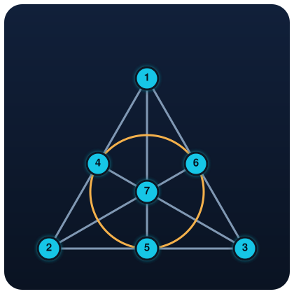
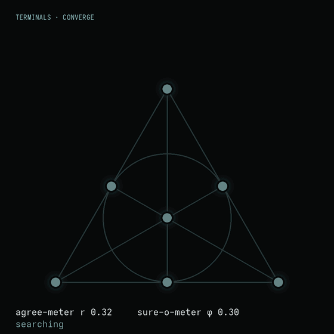
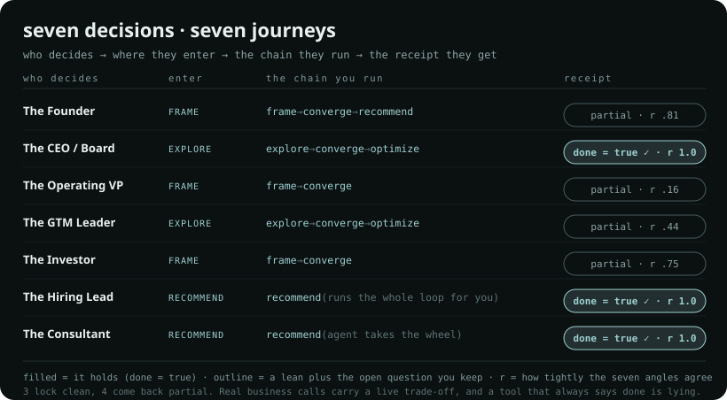
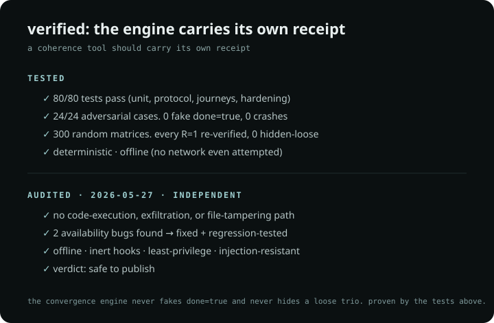
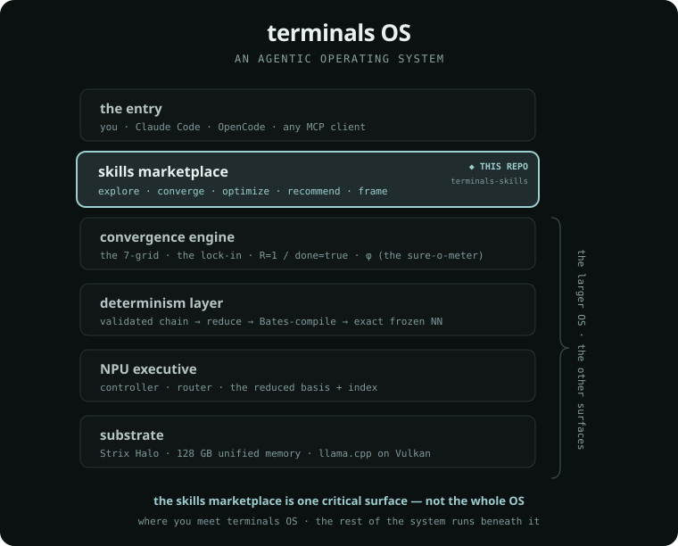

<!-- SPDX-License-Identifier: CC-BY-4.0 -->
<!-- Copyright (c) 2026 Tej Desai / Intuition Labs LLC -->

<p align="center">
  
</p>

<h1 align="center">Terminals</h1>

<p align="center"><b>Five small words that take a messy pile of ideas and hand back an answer that is right, then best, then proven.</b></p>

You type one word. It does the thinking-shape for you and hands back an answer with a receipt that shows it holds together.

<p align="center">
  
  <br>
  <sub><i>A real <code>/converge</code> run. Seven ideas lock into one answer (done = true, R = 1). The agree-meter <code>r</code> and sure-o-meter <code>φ</code> are the engine's own numbers, rendered live from the Kuramoto dynamics. (<a href="scripts/gen_convergence.py">generator</a>)</i></sub>
</p>

## Install

```
/plugin marketplace add Intuition-Labs-LLC/terminals-skills
/plugin install terminals@terminals
```

Type `/converge` and go. No API key. No setup. The math runs on your machine.

## The five words

| word | it means | you get |
|---|---|---|
| `/explore` | open it up | every angle, spread out on purpose |
| `/converge` | bring it together | one right answer, plus the receipt |
| `/optimize` | make it the best one | the same answer in its cheapest, cleanest form |
| `/recommend` | you decide | it runs the whole path and hands you its pick |
| `/frame` | start from my stuff | point it at your folder and it pulls your context in |

`/recommend` runs the whole path for you: explore, then converge, then optimize.

## Try this

Each row is a real call someone has to make. Type the prompt, watch for the thing in the middle, and read what the model hands back. These are real runs, reproduced by the test suite on every commit.

| You type | What to look for | What comes back |
|---|---|---|
| `/recommend` your two term sheets and a bridge, 9 months of cash, you want to keep control | Does it pick a path and say what it refuses to touch? | Raise with the bridge or the priced round. Both keep you in control. It sets revenue-based financing aside because it fights the rest. Bridge versus priced is the call left to you. |
| `/explore` then `/converge` on build the billing system, buy it, or partner | Do all the reasons point one way, or do they fight? | Buy the category leader. Speed, focus, cost, and what customers need all agree. Settled. |
| `/frame` your org notes then `/converge` on cut 15 percent of cost | Will it admit a real trade-off, or force a clean answer? | Only the cut itself holds. Protecting your best people, keeping speed, and morale all pull against the number. You can hit 15 percent or you can hold the team. That trade-off is the decision. |
| `/explore` then `/converge` on price by seats or by usage | Does it land on one model and say which ones it dropped? | Lean to the hybrid, a platform fee plus usage. It keeps revenue predictable and comp simple. It drops pure usage and plain seats. |
| `/frame` the data room on a deal | Does it split what holds from what is risky? | The fundamentals hold. Two things stay open: the customer concentration and the missing head of sales. Price those before you say yes. |
| `/recommend` on a VP Eng hire who is 15 percent over band | Will it commit when the case is strong? | Extend the offer. Track record, culture, the gap she fills, and timing all line up. Settled. |
| `/recommend` to turn a pile of discovery notes into one client plan | One clean plan, or a pile of options? | Wedge into mid-market, partner-led, priced for adoption, with a 12-month proof gate before scaling. One plan. Settled. |

Settled means every reason agreed. When it does not all agree, it gives you the lean plus the one question still left to you, and it never says settled unless it is. The full set lives in [docs/JOURNEYS.md](docs/JOURNEYS.md).

<p align="center">
  
</p>

## The mental model: Point, Line, Lock

- a **Point** is one idea. Seven sit on the grid.
- a **Line** is a trio of ideas that has to agree.
- a **Lock** is the moment a trio snaps into agreement.

When all seven Lock, the answer is **done = true**. The three shapes are the same whether you type the word or the agent reaches for it. That is the whole surface. The plain-English glossary is in [docs/CONCEPTS.md](docs/CONCEPTS.md).

## The receipt

Every word hands back a **witness**: a proof you can check. It carries the answer, the trios that back it, how sure it is (`r`, `phi`), and anything still loose. If it cannot lock everything, it says so plainly and shows the best partial. It never fakes "done."

## Three shapes, one power

- **Command.** You type `/converge`.
- **Skill.** The agent reaches for it on its own when it sees a messy thoughtspace.
- **MCP tool.** Any editor calls the math engine directly.

## Offline by default

Plain Python, standard library only. No network, no key, nothing to sign up for. Want to see and cap what the agent spends (especially `/recommend`)? Run it behind Logfire Gateway. It is opt-in, and keys never touch disk. See [docs/OBSERVE.md](docs/OBSERVE.md).

## Safe by default

The verbs only read. They get no `Write`, no `Bash`, no network. Hooks ship inert. Anything the agent reads (your files, the web) is treated as data to weigh. It will not follow instructions hidden in that text, which is the answer to 2026's top agent risk, prompt injection. Full posture and the signing roadmap: [docs/SECURITY.md](docs/SECURITY.md).

## Verified

<p align="center">
  
</p>

The engine carries its own receipt: **32 tests** (including 3 security regressions), a **24-case adversarial battery** (0 fake `done=true`, 0 crashes), a **300-matrix honesty sweep** (every `R=1` re-verified, zero hidden-loose), and an **independent security audit (2026-05-27)** with no code-execution, exfiltration, or tampering path. The two availability bugs it found are fixed and regression-tested.

## Where this fits: one part of terminals OS

<p align="center">
  
</p>

This repo is the **skills marketplace**, the five verbs you type. It is one critical surface of a larger system. Beneath it sit the convergence engine, the determinism layer (a validated chain, reduced, then compiled to an exact frozen NN), the NPU executive, and the substrate. The marketplace is where you meet terminals OS. The rest of the OS runs beneath it.

## Where it's going, in stages

We ship what works today and label what is still coming.

- **Live now.** The five verbs as commands and skills, the offline engine, a witness on every answer, and an experimental OpenCode flavor.
- **Next.** Signed releases (Sigstore provenance and Merkle-root publication) so you can verify what you install. Bidirectional MCP, where the plugin asks the model, asks you, and renders the witness as live UI, added inert once the spec finalizes (2026-07-28).
- **The open problem.** Terminals is meant to give attention back rather than eat it, and there is no honest metric for that yet. We treat defining one as the real work. The why behind it: [intuitionlabs.tech](https://intuitionlabs.tech).

## License

Split, on purpose: the words and docs are **CC BY 4.0**, and the engine is **AGPL-3.0**. SPDX on every file. Built on the published "Terminals OS paradigm" by Tej Desai / Intuition Labs: the 7-grid, the lock-in, done=true. DOIs in [NOTICE](NOTICE).

Free under AGPL for everyone. If you need to embed the engine in a closed or hosted product without the AGPL source-disclosure obligation, a **commercial license** is available. See [COMMERCIAL-LICENSE.md](COMMERCIAL-LICENSE.md). Contributions are accepted under the [CLA](CLA.md).
